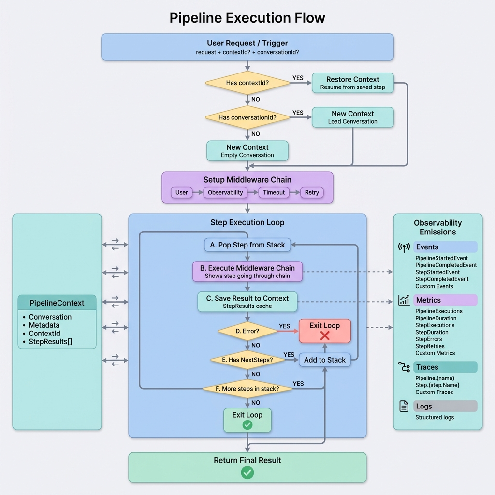
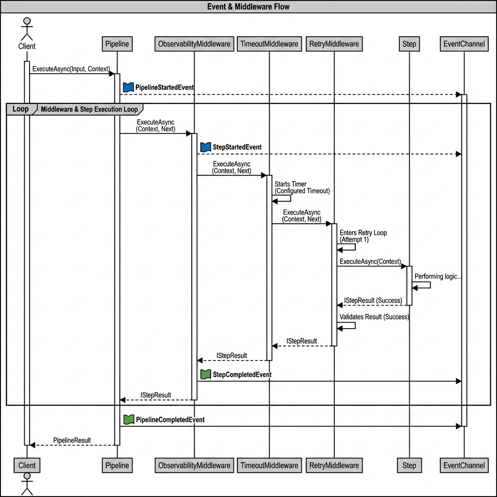
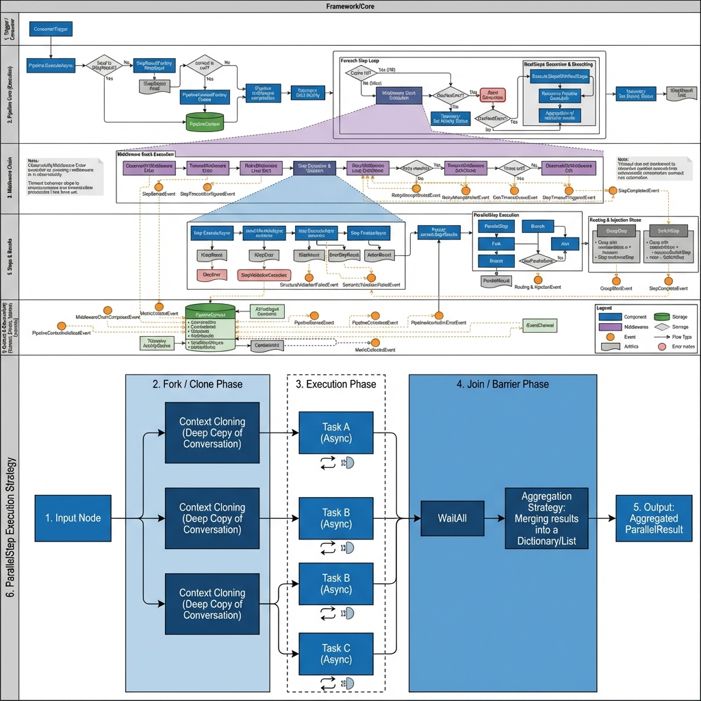
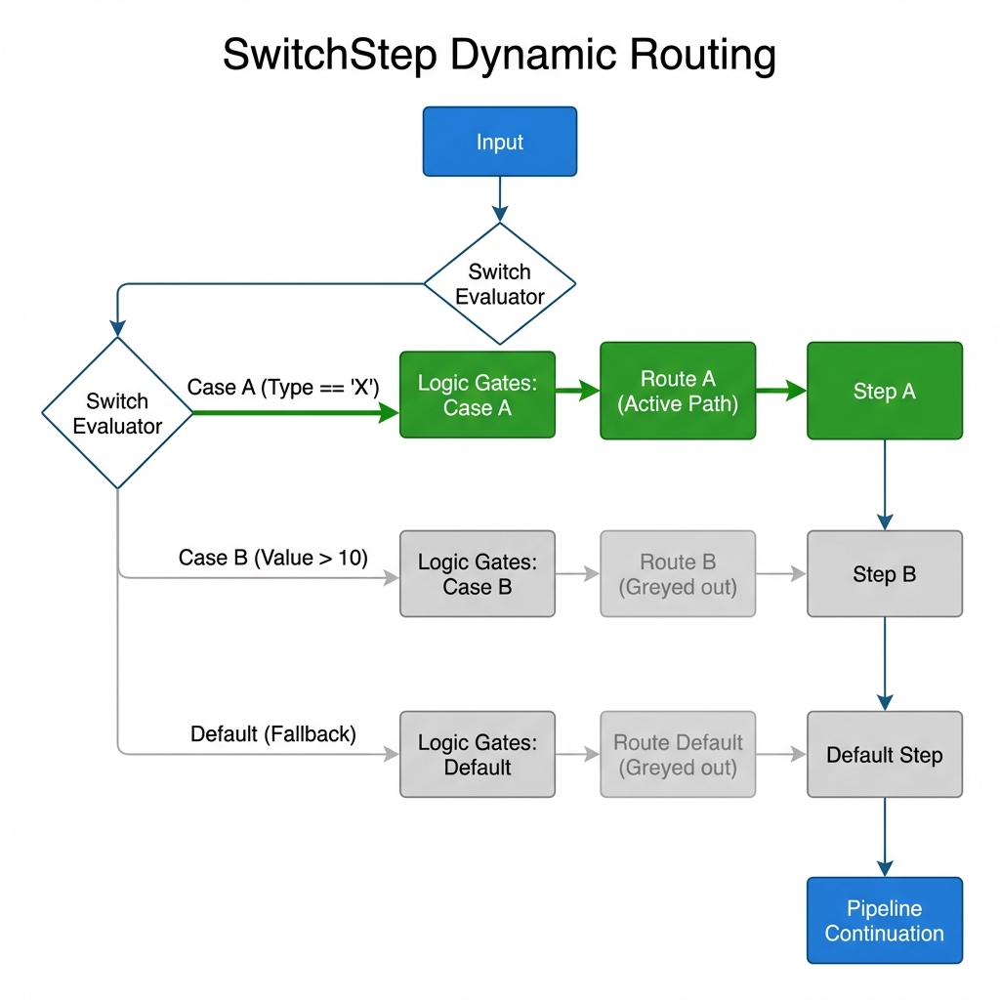
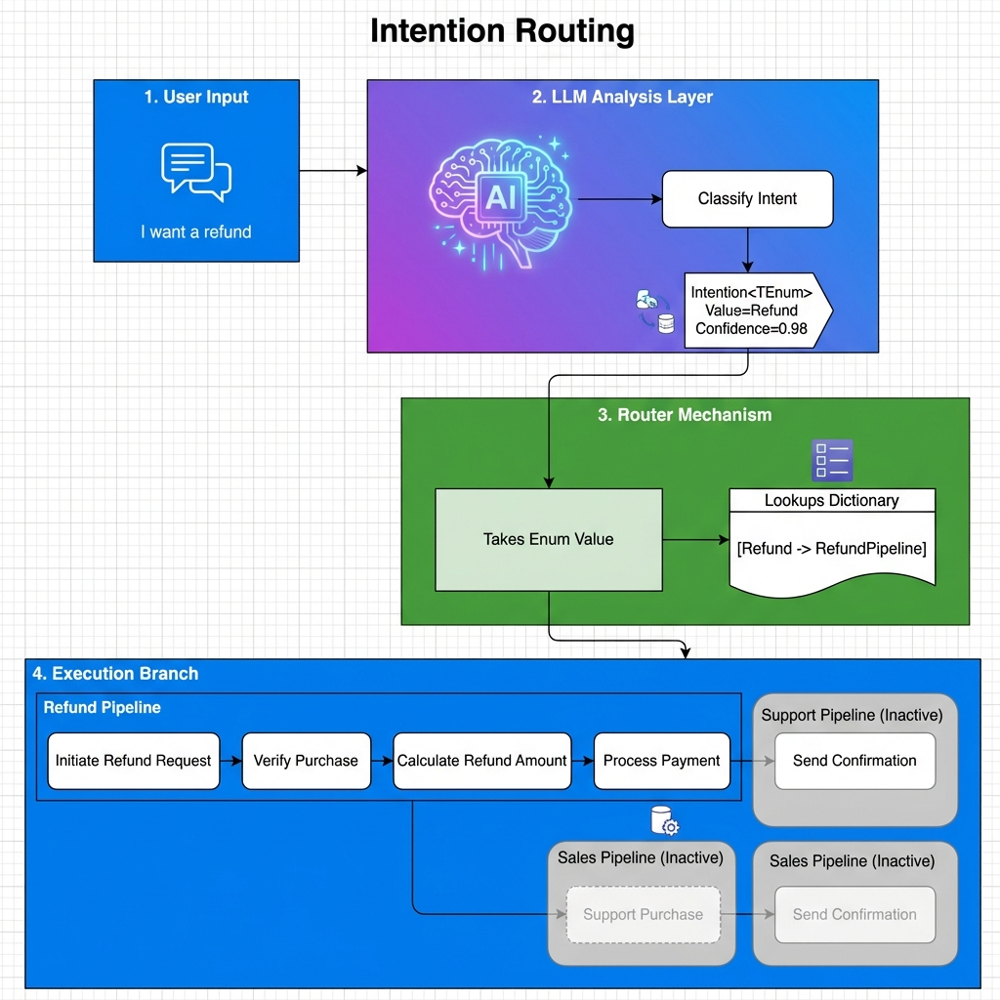

# Architecture

## Overview

AITaskAgent uses a **pipeline architecture** with middleware composition, similar to ASP.NET Core.



## Core Components

### Pipeline

Static executor that runs steps sequentially with middleware composition.

```csharp
await Pipeline.ExecuteAsync(
    name: "MyPipeline",
    steps: [step1, step2],
    input: initialInput,
    context: pipelineContext,
    userMiddlewares: [myMiddleware],
    pipelineTimeout: TimeSpan.FromMinutes(5)
);
```

### PipelineContext

Shared state passed through all steps:

- `Conversation` - LLM conversation with history
- `CorrelationId` - For distributed tracing
- `Metadata` - Custom data (thread-safe)
- `StepResults` - Cached results (thread-safe)
- `SendEventAsync()` - Emit events to observers

### Steps

Units of work implementing `IStep`:

| Step Type | Purpose |
|-----------|---------|
| `ActionStep` | Simple synchronous/async action |
| `TypedStep<TIn, TOut>` | Strongly-typed base class |
| `GroupStep` | Sequential sub-steps |
| `ParallelStep` | Concurrent execution |
| `SwitchStep` | Dynamic routing |
| `BaseLlmStep` | LLM interaction with tools |

### Middleware Chain

Execution order (outer to inner):

```
User Middlewares → Observability → Timeout → Retry → Step
```

Each middleware wraps `next()`:

```csharp
public async Task<IStepResult> InvokeAsync(
    IStep step, IStepResult input, PipelineContext context,
    Func<CancellationToken, Task<IStepResult>> next,
    CancellationToken cancellationToken)
{
    // Before step
    var result = await next(cancellationToken);
    // After step
    return result;
}
```

## Execution Flow



## Non-Linear Flows

### Execution Model

The pipeline is a **Dynamic Execution Graph**:

- **Directed Graph** defined at design time
- **Extensible at runtime** via `NextSteps`
- **Branchable** (GroupStep, SwitchStep)
- **Parallelizable** (ParallelStep)
- **Acyclic by convention** (not enforced technically)

> [!WARNING]
> The framework does **not prevent cycles**. If a step adds itself (or creates a circular reference) to `NextSteps`, it will cause an infinite loop. Always ensure your pipeline design is acyclic.

---

### NextSteps Mechanism

Any step can inject additional steps via `IStepResult.NextSteps`:

```csharp
protected override Task<MyResult> ExecuteAsync(...)
{
    var result = new MyResult(value);
    result.NextSteps.Add(new AdditionalStep());  // Will execute next
    return Task.FromResult(result);
}
```

The Pipeline processes `NextSteps` before moving to the next configured step.

---

### GroupStep (Sequential Branching)

Creates a **branch** in the flow by injecting sequential sub-steps. After the branch completes, execution continues with the parent flow. Groups can be **nested**.


**Key behaviors:**
- Sets `input.NextSteps = [NestedStep1, NestedStep2, ...]` and returns immediately
- Nested steps execute **before** the next step in the parent pipeline
- **Nestable**: A GroupStep can contain another GroupStep
- After all nested steps complete, flow resumes at the next step in the parent

---

### ParallelStep (Concurrent Execution)

Executes multiple steps **concurrently** (not branching, but parallelism):



**Key behaviors:**
- Each task gets a **cloned** `ConversationContext` (isolated LLM history)
- `Metadata` and `StepResults` are **shared** (thread-safe)
- All tasks execute simultaneously
- Results aggregated into `ParallelResult.Results` dictionary
- After all tasks complete, flow continues with the aggregated result

---


### SwitchStep (Dynamic Routing)

Routes to different steps based on runtime logic:



**Usage pattern:**
```csharp
var router = new SwitchStep<MyInput>("Router", (input, ctx) =>
{
    var target = input.Value.Type switch
    {
        "A" => stepA,
        "B" => stepB,
        _ => defaultStep
    };
    return (target, input);
});
```

---

### IntentionRouterStep (LLM-Based Routing)

Combines LLM intent analysis with SwitchStep:



```csharp
enum UserIntent { Sales, Support, FAQ }

var analyzer = new IntentionAnalyzerStep<StringResult, UserIntent>(llmService, profile);
var router = new IntentionRouterStep<UserIntent>(new Dictionary<UserIntent, IStep>
{
    [UserIntent.Sales] = salesPipeline,
    [UserIntent.Support] = supportPipeline,
    [UserIntent.FAQ] = faqPipeline
});
```

## Design Patterns

| Pattern | Usage |
|---------|-------|
| **Middleware** | Pipeline execution chain |
| **Template Method** | `StepBase` hooks for observability |
| **Strategy** | `ILlmService` implementations |
| **Factory** | `PipelineContextFactory`, `StepResultFactory` |
| **Observer** | `IEventChannel` pub/sub |

## Key Interfaces

```csharp
// Step execution
public interface IStep { ... }
public interface IStep<TIn, TOut> : IStep { ... }

// Step results
public interface IStepResult { ... }

// LLM service
public interface ILlmService { ... }

// Tools
public interface ITool { ... }

// Middleware
public interface IPipelineMiddleware { ... }

// Observability
public interface IEventChannel { ... }
public interface IProgressEvent { ... }
```

## Next Steps

- [Core Concepts](../guides/core-concepts.md) - Terminology and lifecycle
- [Middlewares](../guides/middlewares.md) - Deep dive into middleware
- [Event System](../guides/event-system.md) - Observability events
