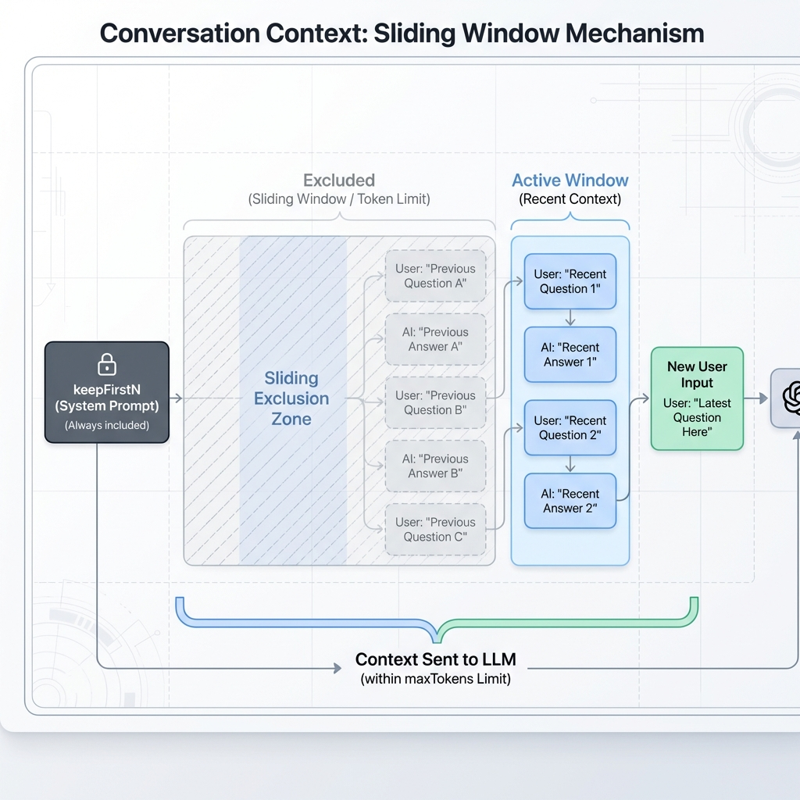

# Conversation

## Overview

`ConversationContext` manages message history for LLM interactions with features like bookmarks and sliding windows.

## Creating a Conversation

```csharp
// Via DI (recommended)
var conversation = services.GetRequiredService<ConversationContext>();

// Manual creation
var conversation = new ConversationContext(
    maxTokens: 4000,
    tokenCounter: text => text.Length / 4  // Approximate
);
```

## Adding Messages

```csharp
// User message
conversation.AddUserMessage("What is the weather?");

// Assistant response
conversation.AddAssistantMessage("The weather is sunny.");

// System message
conversation.AddSystemMessage("You are a helpful assistant.");

// Tool response
conversation.AddToolMessage(toolCallId: "call_123", content: "25°C");

// With tool calls
conversation.AddAssistantMessageWithToolCalls(new[] {
    new ToolCall { Id = "call_123", Name = "weather", Arguments = "{}" }
});
```

## Bookmarks

Save and restore conversation state for retry scenarios:

```csharp
// Create bookmark before LLM call
var bookmark = conversation.CreateBookmark();

// ... LLM interaction ...

if (!validated)
{
    // Restore to bookmark (removes all messages after)
    conversation.RestoreBookmark(bookmark);
    
    // Add clean messages
    conversation.AddUserMessage(originalPrompt);
    conversation.AddAssistantMessage(correctedResponse);
}
```

## Sliding Window

Manage context size by keeping recent messages:



```csharp
// Get messages with sliding window
var messages = conversation.GetMessagesForRequest(
    maxTokens: 8192,
    useSlidingWindow: true
);

// Keeps first N messages (system context) + recent messages
var messages = conversation.History.GetMessagesWithSlidingWindow(
    keepFirstN: 2,
    maxTokens: 8192
);
```

## MessageHistory

Low-level access to message management:

```csharp
// Add message
conversation.History.AddMessage(new Message
{
    Role = "user",
    Content = "Hello"
});

// Get all messages
var all = conversation.History.Messages;

// Get recent messages
var recent = conversation.History.GetRecentMessages(maxTokens: 4000);

// Clone history
var clone = conversation.Clone();
```

## PipelineContext Integration

Conversation is part of `PipelineContext`:

```csharp
var context = contextFactory.Create();

// Access conversation
context.Conversation.AddUserMessage("Query");

// Clone for parallel branches
var branchContext = context.CloneForBranch();
// Each branch gets isolated conversation copy
```

## Token Counting

```csharp
// Custom token counter
var conversation = new ConversationContext(
    maxTokens: 4000,
    tokenCounter: llmService.EstimateTokenCount
);

// Check token usage
var totalTokens = conversation.History.EstimateTokenCount();
```
