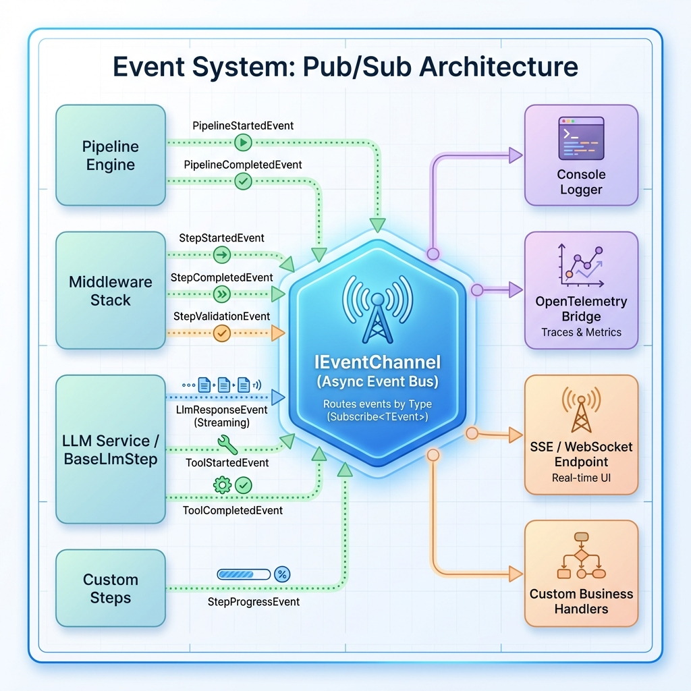

# Event System

## Overview

AITaskAgent includes a real-time event system for observability. Events flow through `IEventChannel` to subscribers.



## Architecture

### IProgressEvent

Base interface for all events:

```csharp
public interface IProgressEvent
{
    string StepName { get; }        // Emitting step
    string EventType { get; }       // e.g., "step.completed"
    DateTimeOffset Timestamp { get; }
    string? CorrelationId { get; }
}
```

### IEventChannel

Async pub/sub channel:

```csharp
public interface IEventChannel
{
    Task SendAsync<TEvent>(TEvent progressEvent, CancellationToken ct = default)
        where TEvent : IProgressEvent;
}
```

### Sending Events

```csharp
await context.SendEventAsync(new MyEvent
{
    StepName = "MyStep",
    CorrelationId = context.CorrelationId,
    // ... custom properties
}, cancellationToken);
```

## Complete Event Catalog (12 Types)

| Event | EventType | Emitted By | Description |
|-------|-----------|------------|-------------|
| `PipelineStartedEvent` | `pipeline.started` | Pipeline | Pipeline execution begins |
| `PipelineCompletedEvent` | `pipeline.completed` | Pipeline | Pipeline execution ends |
| `StepStartedEvent` | `step.started` | ObservabilityMiddleware | Before step execution |
| `StepCompletedEvent` | `step.completed` | ObservabilityMiddleware | After step execution |
| `StepProgressEvent` | `step.progress` | Step (custom) | Intermediate progress |
| `StepRoutingEvent` | `step.routing` | SwitchStep | Route selection |
| `StepValidationEvent` | `step.validation` | RetryMiddleware | Validation result |
| `LlmResponseEvent` | `llm.response` | BaseLlmStep | LLM response (streaming/final) |
| `ToolStartedEvent` | `tool.started` | BaseLlmStep | Tool execution begins |
| `ToolCompletedEvent` | `tool.completed` | BaseLlmStep | Tool execution ends |

### Event Details

#### StepCompletedEvent
```csharp
public sealed record StepCompletedEvent : ProgressEventBase, IStepCompletedEvent
{
    public bool Success { get; init; }
    public TimeSpan Duration { get; init; }
    public string? ErrorMessage { get; init; }
    public Dictionary<string, object?>? AdditionalData { get; set; }
}
```

#### LlmResponseEvent
```csharp
public sealed record LlmResponseEvent : ProgressEventBase
{
    public required string Content { get; init; }
    public FinishReason FinishReason { get; init; }  // Streaming = chunk
    public int TokensUsed { get; init; }
    public string? Model { get; init; }
    public string? Provider { get; init; }
}
```

#### ToolCompletedEvent
```csharp
public sealed record ToolCompletedEvent : ProgressEventBase
{
    public required string ToolName { get; init; }
    public bool Success { get; init; }
    public TimeSpan Duration { get; init; }
    public string? ErrorMessage { get; init; }
}
```

## Subscribing to Events

```csharp
var eventChannel = services.GetRequiredService<IEventChannel>();

// Subscribe to specific event type
eventChannel.Subscribe<StepCompletedEvent>(async e =>
{
    Console.WriteLine($"Step {e.StepName}: {(e.Success ? "OK" : "FAILED")}");
    Console.WriteLine($"Duration: {e.Duration.TotalMilliseconds}ms");
});

// Subscribe to LLM streaming
eventChannel.Subscribe<LlmResponseEvent>(async e =>
{
    if (e.FinishReason == FinishReason.Streaming)
        Console.Write(e.Content);  // Stream chunk
    else
        Console.WriteLine($"\n[{e.TokensUsed} tokens]");  // Final
});
```

## Enriching Events in Custom Steps

Steps implementing `IEnrichableStep` can add custom data to events:

### IEnrichableStep Interface

```csharp
public interface IEnrichableStep : IStep
{
    // OpenTelemetry tags before execution
    void EnrichActivityBefore(Activity? activity, IStepResult input, PipelineContext context);
    
    // OpenTelemetry tags after execution
    void EnrichActivityAfter(Activity? activity, IStepResult result, PipelineContext context);
    
    // Custom data in StepStartedEvent
    StepStartedEvent EnrichStartedEvent(StepStartedEvent baseEvent, IStepResult input, PipelineContext context);
    
    // Custom data in StepCompletedEvent
    IStepCompletedEvent EnrichCompletedEvent(IStepCompletedEvent baseEvent, IStepResult result, PipelineContext context);
}
```

### Example: StepBase Implementation

```csharp
public class MyLlmStep : TypedStep<InputResult, LlmStepResult>, IEnrichableStep
{
    protected override IStepCompletedEvent EnrichCompletedEvent(
        IStepCompletedEvent baseEvent, 
        IStepResult result, 
        PipelineContext context)
    {
        if (result is LlmStepResult llmResult)
        {
            return baseEvent with
            {
                AdditionalData = new Dictionary<string, object?>
                {
                    ["tokensUsed"] = llmResult.TokensUsed,
                    ["model"] = llmResult.Model,
                    ["costUsd"] = llmResult.CostUsd
                }
            };
        }
        return baseEvent;
    }
    
    protected override void EnrichActivityAfter(
        Activity? activity, 
        IStepResult result, 
        PipelineContext context)
    {
        if (result is LlmStepResult llmResult)
        {
            activity?.SetTag("llm.tokens", llmResult.TokensUsed);
            activity?.SetTag("llm.model", llmResult.Model);
        }
    }
}
```

### BaseLlmStep Enrichment

`BaseLlmStep` automatically enriches events with:
- `llm.model` - Model used
- `llm.provider` - Provider name
- `llm.tokens_used` - Total tokens
- `llm.cost_usd` - Estimated cost

## Creating Custom Events

See [Custom Events](../extensibility/custom-events.md) for creating your own event types.
