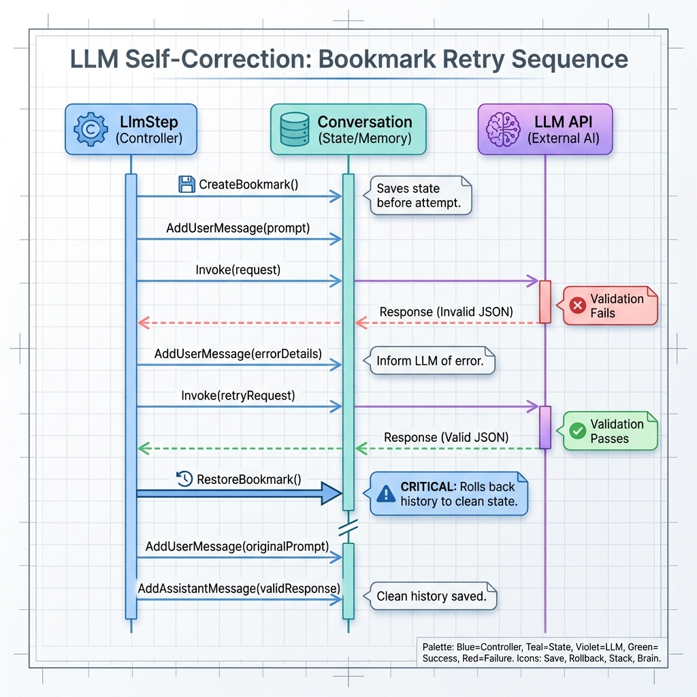

# LLM Steps

## Overview

LLM steps interact with Large Language Models. They support:
- Automatic retry with conversation bookmarks
- Tool execution
- JSON response parsing
- Streaming

## BaseLlmStep

The foundation for all LLM steps:

```csharp
var llmStep = new BaseLlmStep<InputResult, OutputResult>(
    llmService,
    name: "AnalyzeText",
    profile: providerResolver.Resolve("default"),
    messageBuilder: async (input, ctx) => $"Analyze: {input.Text}",
    systemMessageBuilder: async (input, ctx) => "You are an analyst.",
    tools: [new SearchTool(), new CalculatorTool()],
    resultValidator: async (result) => (result.Value != null, "Value required")
);
```

### Constructor Parameters

| Parameter | Type | Description |
|-----------|------|-------------|
| `llmService` | `ILlmService` | LLM provider |
| `name` | `string` | Step identifier |
| `profile` | `LlmProviderConfig` | Model configuration |
| `messageBuilder` | `Func<TIn, Context, Task<string>>` | User message |
| `systemMessageBuilder` | `Func<TIn, Context, Task<string>>?` | System prompt |
| `tools` | `List<ITool>?` | Available tools |
| `resultValidator` | `Func<TOut, Task<(bool, string?)>>?` | Custom validation |

## LlmStep

Simplified version without custom validators:

```csharp
var step = new LlmStep<StringResult, LlmStepResult>(
    llmService,
    "QuickAnswer",
    profile,
    messageBuilder: (input, ctx) => Task.FromResult($"Question: {input.Value}")
);
```

## TemplateLlmStep

Uses template engine for prompts:

```csharp
var step = new TemplateLlmStep<DataResult, AnalysisResult>(
    llmService,
    "TemplatedAnalysis",
    profile,
    promptTemplate: "Analyze the following data: {{data}}\nFocus on: {{focus}}",
    dataExtractor: (input, ctx) => new { data = input.Data, focus = "trends" }
);
```

## Retry with Bookmarks

When validation fails, the step:

1. Creates a bookmark before first attempt
2. On failure, adds error message to conversation
3. LLM sees the error and tries to self-correct
4. If successful, restores bookmark and adds clean response



## Tool Execution

Tools are executed recursively until no more tool calls:

```csharp
var step = new LlmStep<QueryResult, AnswerResult>(
    llmService,
    "ResearchAgent",
    profile,
    messageBuilder: (input, ctx) => Task.FromResult(input.Query),
    tools: [
        new WebSearchTool(),
        new DatabaseQueryTool()
    ]
) { MaxToolIterations = 5 };
```

## Streaming

Enable streaming for real-time responses:

```csharp
// In LlmRequest
var request = new LlmRequest
{
    Conversation = context.Conversation,
    Profile = profile,
    UseStreaming = true
};

// Subscribe to streaming events
eventChannel.Subscribe<LlmResponseEvent>(e => {
    if (e.FinishReason == FinishReason.Streaming)
        Console.Write(e.Content); // Chunk
    else
        Console.WriteLine($"\n[Done: {e.TokensUsed} tokens]");
});
```

## JSON Response Parsing

For typed results, the step automatically:

1. Generates JSON schema from `TOut`
2. Includes schema in prompt or uses native JSON mode
3. Parses and validates response

```csharp
public record AnalysisResult : LlmStepResult
{
    public string Sentiment { get; init; }
    public List<string> Topics { get; init; }
    public double Confidence { get; init; }
}
```
