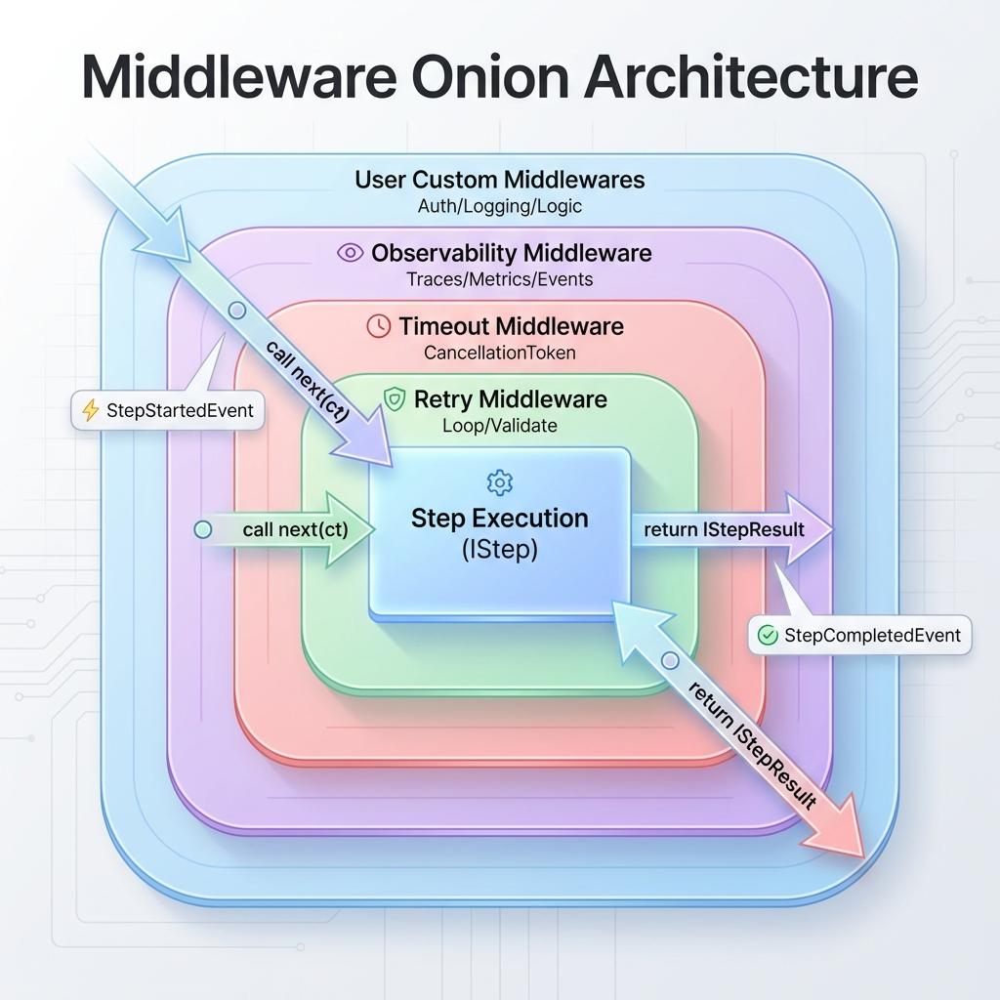

# Middlewares

## Overview

Middlewares wrap step execution to add cross-cutting concerns. They follow the ASP.NET Core middleware pattern.

## Middleware Chain

Execution order (outer to inner):

```
User Middlewares → ObservabilityMiddleware → TimeoutMiddleware → RetryMiddleware → Step.ExecuteAsync
```



## IPipelineMiddleware

```csharp
public interface IPipelineMiddleware
{
    Task<IStepResult> InvokeAsync(
        IStep step,
        IStepResult input,
        PipelineContext context,
        Func<CancellationToken, Task<IStepResult>> next,
        CancellationToken cancellationToken);
}
```

## Internal Middlewares

### ObservabilityMiddleware

Always first. Provides:
- OpenTelemetry traces (`Activity`)
- Native metrics (counters, histograms)
- Event emission (`StepStartedEvent`, `StepCompletedEvent`)
- Enrichment hooks for `IEnrichableStep`

### TimeoutMiddleware

Creates linked `CancellationToken` with step timeout:

```csharp
// Default timeout from Pipeline.DefaultStepTimeout
// Or per-step via IStep.Timeout property
```

### RetryMiddleware

Terminal middleware that handles retry logic:

1. Executes `step.ExecuteAsync()`
2. Calls `step.ValidateAsync()`
3. If invalid and attempts < max, retries with error context
4. Calls `step.FinalizeAsync()` on completion

## Injecting Custom Middlewares

```csharp
var myMiddlewares = new IPipelineMiddleware[]
{
    new LoggingMiddleware(),
    new MetricsMiddleware()
};

await Pipeline.ExecuteAsync(
    name: "MyPipeline",
    steps: steps,
    input: input,
    userMiddlewares: myMiddlewares  // Added BEFORE internal middlewares
);
```

## Creating a Custom Middleware

```csharp
using AITaskAgent.Core.Abstractions;
using AITaskAgent.Core.Models;

public class LoggingMiddleware(ILogger<LoggingMiddleware> logger) : IPipelineMiddleware
{
    public async Task<IStepResult> InvokeAsync(
        IStep step,
        IStepResult input,
        PipelineContext context,
        Func<CancellationToken, Task<IStepResult>> next,
        CancellationToken cancellationToken)
    {
        // BEFORE step
        logger.LogInformation("Step {StepName} starting", step.Name);
        var sw = Stopwatch.StartNew();
        
        try
        {
            // Execute next middleware (or step)
            var result = await next(cancellationToken);
            
            // AFTER step (success)
            sw.Stop();
            logger.LogInformation(
                "Step {StepName} completed in {Duration}ms, success: {Success}",
                step.Name, sw.ElapsedMilliseconds, !result.HasError);
            
            return result;
        }
        catch (Exception ex)
        {
            // AFTER step (exception)
            sw.Stop();
            logger.LogError(ex, 
                "Step {StepName} failed after {Duration}ms", 
                step.Name, sw.ElapsedMilliseconds);
            throw;
        }
    }
}
```

## Example: ContextBroadcastMiddleware

From PipelineVisualizer - emits context snapshots after each step:

```csharp
public sealed class ContextBroadcastMiddleware(
    ILogger<ContextBroadcastMiddleware> logger) : IPipelineMiddleware
{
    public async Task<IStepResult> InvokeAsync(
        IStep step,
        IStepResult input,
        PipelineContext context,
        Func<CancellationToken, Task<IStepResult>> next,
        CancellationToken cancellationToken)
    {
        var result = await next(cancellationToken);
        
        try
        {
            var snapshot = new ContextSnapshotEvent
            {
                StepName = step.Name,
                CorrelationId = context.CorrelationId,
                CurrentPath = context.CurrentPath,
                StepResults = SerializeStepResults(context),
                Metadata = SerializeMetadata(context)
            };
            
            await context.SendEventAsync(snapshot, cancellationToken);
        }
        catch (Exception ex)
        {
            // Never fail the pipeline due to snapshot errors
            logger.LogWarning(ex, "Failed to emit snapshot");
        }
        
        return result;
    }
}
```

## Best Practices

1. **Call `next()`** - Always invoke the next middleware
2. **Use try/finally** - Ensure cleanup runs
3. **Don't swallow exceptions** - Unless intentional
4. **Keep stateless** - Middlewares are reused
5. **Order matters** - User middlewares run first
