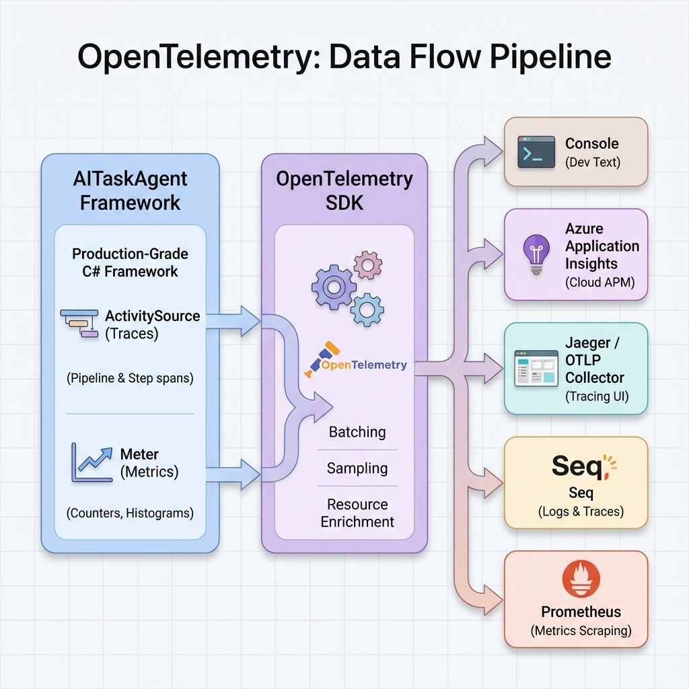

# OpenTelemetry Integration

## Overview

AITaskAgent has built-in OpenTelemetry support. The framework emits traces via `System.Diagnostics.Activity` which are automatically captured by OpenTelemetry.

## Built-in Telemetry



The framework already emits:

| Source | What's Tracked |
|--------|----------------|
| `Telemetry.Source` | Activities for Pipeline and Step execution |
| `Metrics` | Counters and histograms for steps, LLM calls, tokens |
| `EventChannel` | Real-time events (can be bridged to traces) |

## Basic Setup

### 1. Install Packages

```bash
# Core OpenTelemetry
dotnet add package OpenTelemetry
dotnet add package OpenTelemetry.Extensions.Hosting

# Exporters (pick what you need)
dotnet add package OpenTelemetry.Exporter.Console
dotnet add package OpenTelemetry.Exporter.OpenTelemetryProtocol

# For Application Insights
dotnet add package Azure.Monitor.OpenTelemetry.Exporter

# For Seq
dotnet add package OpenTelemetry.Exporter.OpenTelemetryProtocol
```

### 2. Configure OpenTelemetry

```csharp
using AITaskAgent.Configuration;
using AITaskAgent.Core.Base;
using OpenTelemetry.Resources;
using OpenTelemetry.Trace;
using OpenTelemetry.Metrics;

var builder = Host.CreateApplicationBuilder(args);

// Add AITaskAgent
builder.Services.AddAITaskAgent();

// Configure OpenTelemetry to capture AITaskAgent traces
builder.Services.AddOpenTelemetry()
    .ConfigureResource(resource => resource
        .AddService("MyAIAgent")
        .AddAttributes(new Dictionary<string, object>
        {
            ["deployment.environment"] = builder.Environment.EnvironmentName
        }))
    .WithTracing(tracing => tracing
        // Capture AITaskAgent traces
        .AddSource(AITaskAgentConstants.TelemetryTags.ActivitySourceName)
        .AddConsoleExporter())
    .WithMetrics(metrics => metrics
        // Capture AITaskAgent metrics
        .AddMeter(AITaskAgentConstants.TelemetryTags.MeterName)
        .AddConsoleExporter());

var host = builder.Build();
```

---

## Application Insights

### Configuration

```csharp
using Azure.Monitor.OpenTelemetry.Exporter;

builder.Services.AddOpenTelemetry()
    .ConfigureResource(resource => resource.AddService("MyAIAgent"))
    .WithTracing(tracing => tracing
        .AddSource(AITaskAgentConstants.TelemetryTags.ActivitySourceName)
        .AddAzureMonitorTraceExporter(options =>
        {
            options.ConnectionString = builder.Configuration["ApplicationInsights:ConnectionString"];
        }))
    .WithMetrics(metrics => metrics
        .AddMeter(AITaskAgentConstants.TelemetryTags.MeterName)
        .AddAzureMonitorMetricExporter(options =>
        {
            options.ConnectionString = builder.Configuration["ApplicationInsights:ConnectionString"];
        }));
```

### appsettings.json

```json
{
  "ApplicationInsights": {
    "ConnectionString": "InstrumentationKey=xxx;IngestionEndpoint=https://xxx.in.applicationinsights.azure.com/"
  }
}
```

### Query in Application Insights

```kusto
// View pipeline traces
traces
| where customDimensions.["pipeline.name"] != ""
| project timestamp, operation_Name, customDimensions

// LLM performance
customMetrics
| where name == "aitaskagent.llm.tokens"
| summarize sum(value) by bin(timestamp, 1h)
```

---

## Seq

Seq supports OTLP ingestion natively.

### Configuration

```csharp
using OpenTelemetry.Exporter;

builder.Services.AddOpenTelemetry()
    .ConfigureResource(resource => resource.AddService("MyAIAgent"))
    .WithTracing(tracing => tracing
        .AddSource(AITaskAgentConstants.TelemetryTags.ActivitySourceName)
        .AddOtlpExporter(options =>
        {
            // Seq OTLP endpoint
            options.Endpoint = new Uri("http://localhost:5341/ingest/otlp/v1/traces");
            options.Protocol = OtlpExportProtocol.HttpProtobuf;
        }))
    .WithMetrics(metrics => metrics
        .AddMeter(AITaskAgentConstants.TelemetryTags.MeterName)
        .AddOtlpExporter(options =>
        {
            options.Endpoint = new Uri("http://localhost:5341/ingest/otlp/v1/metrics");
            options.Protocol = OtlpExportProtocol.HttpProtobuf;
        }));
```

### Docker Compose for Seq

```yaml
services:
  seq:
    image: datalust/seq:latest
    ports:
      - "5341:5341"  # Ingestion (OTLP)
      - "5342:80"    # UI
    environment:
      - ACCEPT_EULA=Y
```

---

## Jaeger

```csharp
builder.Services.AddOpenTelemetry()
    .WithTracing(tracing => tracing
        .AddSource(AITaskAgentConstants.TelemetryTags.ActivitySourceName)
        .AddOtlpExporter(options =>
        {
            options.Endpoint = new Uri("http://localhost:4317");
        }));
```

### Docker Compose for Jaeger

```yaml
services:
  jaeger:
    image: jaegertracing/all-in-one:latest
    ports:
      - "4317:4317"  # OTLP gRPC
      - "16686:16686" # UI
```

## Metrics (Counters & Histograms)

AITaskAgent emits the following metrics via `System.Diagnostics.Metrics`.

> [!NOTE]
> Metrics include dimensions (tags) allowing filtering by pipeline, step, LLM model, etc.

### Counters

| Metric Name | Dimensions | Description |
|-------------|------------|-------------|
| `aitaskagent.pipeline.executions` | `pipeline.name` | Total pipeline executions |
| `aitaskagent.step.executions` | `step.name`, `step.success` | Total step executions |
| `aitaskagent.step.errors` | `step.name` | Total step errors |
| `aitaskagent.step.retries` | `step.name` | Total step retries |
| `aitaskagent.llm.requests` | `llm.model`, `llm.provider` | Total LLM API requests |
| `aitaskagent.llm.tokens` | `llm.model`, `llm.provider` | Total tokens used |
| `aitaskagent.llm.cost` | `llm.model`, `llm.provider` | Total LLM cost (USD) |
| `aitaskagent.tool.executions` | `tool.name`, `step.success` | Total tool executions |

### Histograms

| Metric Name | Dimensions | Description |
|-------------|------------|-------------|
| `aitaskagent.step.duration` | `step.name` | Step execution duration (ms) |
| `aitaskagent.llm.duration` | `llm.model`, `llm.provider` | LLM call duration (ms) |
| `aitaskagent.pipeline.duration` | `pipeline.name`, `step.success` | Pipeline execution duration (ms) |
| `aitaskagent.tool.duration` | `tool.name` | Tool execution duration (ms) |

### Query Examples

```kusto
// Tokens by model (Application Insights)
customMetrics
| where name == "aitaskagent.llm.tokens"
| extend model = tostring(customDimensions["llm.model"])
| summarize sum(value) by model, bin(timestamp, 1h)

// Step errors by name
customMetrics
| where name == "aitaskagent.step.errors"
| extend stepName = tostring(customDimensions["step.name"])
| summarize count() by stepName

// P95 step duration
customMetrics
| where name == "aitaskagent.step.duration"
| summarize percentile(value, 95) by tostring(customDimensions["step.name"])
```

---

## Trace Tags

AITaskAgent adds these tags to traces:

| Tag | Description |
|-----|-------------|
| `pipeline.name` | Pipeline identifier |
| `pipeline.step_count` | Number of steps |
| `pipeline.timeout_ms` | Pipeline timeout |
| `step.name` | Step identifier |
| `step.type` | Step class name |
| `step.success` | Execution success |
| `step.duration_ms` | Execution time |
| `correlation_id` | Request correlation |
| `llm.model` | LLM model used |
| `llm.provider` | Provider name |
| `llm.tokens_used` | Total tokens |

| `llm.tokens_used` | Total tokens |

---

## Structured Logging & Scopes

The framework leverages **Structured Logging** with **Scopes** to automatically tag log entries with context, even if those logs occur deep within injected services.

### Automatic Pipeline Scope

Every execution of `IStep` is automatically wrapped in a Logging Scope containing:

- **`Step`**: Name of the currently executing step (e.g., "SchemaValidator").
- **`Path`**: Hierarchical execution path (e.g., "MainPipeline/Router/SalesPipeline").
- **`CorrelationId`**: The global trace ID.

### Benefit: Independent Step Logging

This architecture allows you to isolate logs for a specific logical step without needing to pass `ILogger` manually through your entire call stack.

**Example: Filter logs for "SchemaValidator" step (Serilog):**

```csharp
Log.Logger = new LoggerConfiguration()
    .WriteTo.Console()
    .Filter.ByIncludingOnly(logEvent => 
        logEvent.Properties.ContainsKey("Step") && 
        logEvent.Properties["Step"].ToString().Contains("SchemaValidator"))
    .CreateLogger();
```

Use `ILogger<T>` in your middlewares and services normally. The framework ensures their output is correctly tagged with the active Step context.

---

## Full Example

```csharp
using AITaskAgent.Configuration;
using AITaskAgent.Core.Base;
using AITaskAgent.Core.Execution;
using AITaskAgent.Core.Steps;
using AITaskAgent.Core.StepResults;
using Azure.Monitor.OpenTelemetry.Exporter;
using OpenTelemetry.Resources;
using OpenTelemetry.Trace;
using OpenTelemetry.Metrics;

try
{
    var builder = Host.CreateApplicationBuilder(args);
    
    // AITaskAgent
    builder.Services.AddAITaskAgent();
    
    // OpenTelemetry with multiple exporters
    builder.Services.AddOpenTelemetry()
        .ConfigureResource(r => r.AddService("MyAIAgent"))
        .WithTracing(t => t
            .AddSource(AITaskAgentConstants.TelemetryTags.ActivitySourceName)
            .AddConsoleExporter()
            .AddAzureMonitorTraceExporter(o => 
                o.ConnectionString = builder.Configuration["AppInsights:ConnectionString"]))
        .WithMetrics(m => m
            .AddMeter(AITaskAgentConstants.TelemetryTags.MeterName)
            .AddConsoleExporter());
    
    var host = builder.Build();
    Pipeline.LoggerFactory = host.Services.GetRequiredService<ILoggerFactory>();
    
    // Execute pipeline - traces will be sent automatically
    var result = await Pipeline.ExecuteAsync(
        name: "TracedPipeline",
        steps: [
            new ActionStep<EmptyResult, StringResult>("Step1", 
                (i, c) => Task.FromResult(new StringResult("Hello")))
        ],
        input: new EmptyResult()
    );
    
    Console.WriteLine($"Result: {((StringResult)result).Value}");
    
    // Allow time for export
    await Task.Delay(2000);
}
catch (Exception ex)
{
    Console.WriteLine($"Error: {ex.Message}");
}
```
