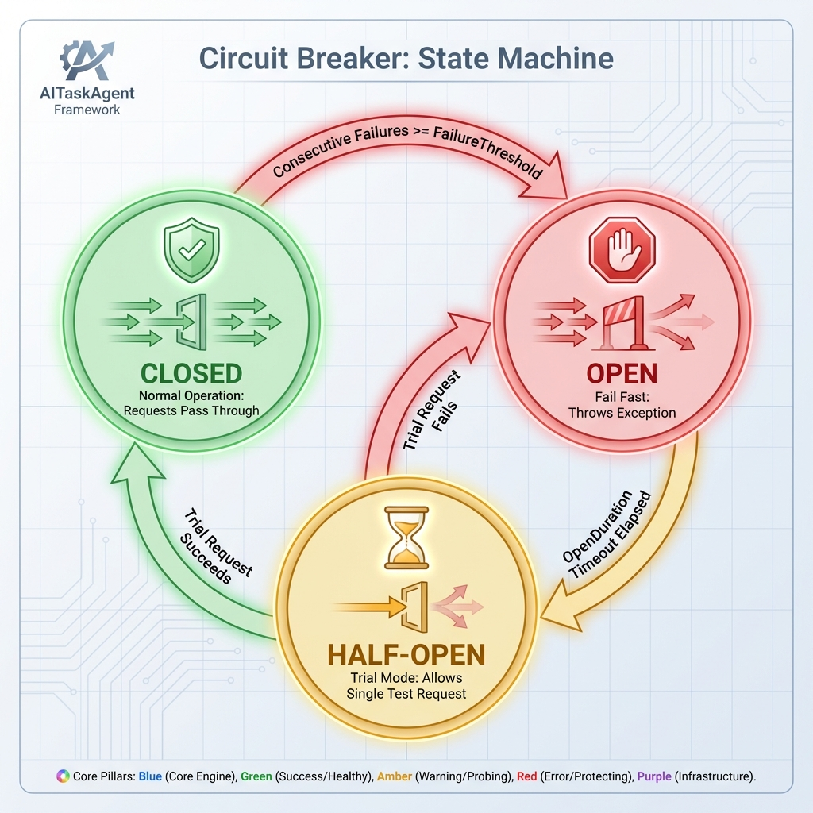

# Resilience

## Overview

AITaskAgent includes built-in resilience patterns to handle transient failures and protect external services.

## Components

| Component | Pattern | Purpose |
|-----------|---------|---------|
| `RetryMiddleware` | Retry | Automatic retries with backoff |
| `TimeoutMiddleware` | Timeout | Step execution time limits |
| `CircuitBreaker` | Circuit Breaker | Prevent cascading failures |
| `RateLimiter` | Token Bucket | Rate limit API calls |

---

## CircuitBreaker

Prevents cascading failures by tracking consecutive errors.

### States



### Usage

```csharp
using AITaskAgent.Resilience;

var circuitBreaker = new CircuitBreaker(
    failureThreshold: 5,        // Open after 5 failures
    openDuration: TimeSpan.FromMinutes(1)
);

try
{
    var result = await circuitBreaker.ExecuteAsync(async () =>
    {
        return await httpClient.GetAsync("https://api.example.com/data");
    });
}
catch (CircuitBreakerOpenException)
{
    // Circuit is open, use fallback
    return GetCachedData();
}
```

### Properties

| Property | Type | Description |
|----------|------|-------------|
| `State` | `CircuitState` | Current state (Closed, Open, HalfOpen) |

### Methods

| Method | Description |
|--------|-------------|
| `ExecuteAsync<T>()` | Execute action through circuit |
| `Reset()` | Manually reset to Closed |

---

## RateLimiter

Token bucket algorithm for rate limiting.

### How It Works

```
Bucket: [●●●●●●●●●●] (10 tokens)
         ↓
Request: Consume 1 token
         ↓
Bucket: [●●●●●●●●●○] (9 tokens)
         ↓
... time passes ...
         ↓
Refill: Add tokens back
```

### Usage

```csharp
using AITaskAgent.Resilience;

var rateLimiter = new RateLimiter(
    maxTokens: 10,
    refillInterval: TimeSpan.FromSeconds(1),
    tokensPerRefill: 10
);

// Wait until token available
await rateLimiter.WaitAsync(cancellationToken);
await CallExternalApi();

// Or try without waiting
if (rateLimiter.TryAcquire())
{
    await CallExternalApi();
}
else
{
    // No tokens available, return cached or throttle
}
```

### Properties

| Property | Type | Description |
|----------|------|-------------|
| `AvailableTokens` | `int` | Current available tokens |

---

## RetryMiddleware

Built-in middleware for automatic retries with validation.

### Behavior

1. Executes step
2. If exception → retry (up to `MaxRetries`)
3. If `IStepResult.HasError` with `IsRecoverable` → retry
4. Runs structural validation → retry if failed
5. Runs semantic validation → retry if failed
6. Final failure → return error result

### Configuration

Retries are configured per-step:

```csharp
public class MyStep : StepBase
{
    public override int MaxRetries => 3;
    public override int MillisecondsBetweenRetries => 500;
}
```

---

## TimeoutMiddleware

Enforces execution time limits per step.

### Configuration

```csharp
public class SlowStep : StepBase
{
    public override TimeSpan? Timeout => TimeSpan.FromSeconds(30);
}
```

Pipeline-level timeout:

```csharp
await Pipeline.ExecuteAsync(
    name: "TimedPipeline",
    steps: [step1, step2],
    input: new EmptyResult(),
    pipelineTimeout: TimeSpan.FromMinutes(5)
);
```

---

## Integration with LLM

### LLM with Circuit Breaker

```csharp
public class ResilientLlmService : ILlmService
{
    private readonly ILlmService _inner;
    private readonly CircuitBreaker _circuitBreaker;
    
    public async Task<LlmResponse> InvokeAsync(LlmRequest request, CancellationToken ct)
    {
        return await _circuitBreaker.ExecuteAsync(async () =>
        {
            return await _inner.InvokeAsync(request, ct);
        });
    }
}
```

### LLM with Rate Limiting

```csharp
public class RateLimitedLlmService : ILlmService
{
    private readonly ILlmService _inner;
    private readonly RateLimiter _rateLimiter;
    
    public async Task<LlmResponse> InvokeAsync(LlmRequest request, CancellationToken ct)
    {
        await _rateLimiter.WaitAsync(ct);
        return await _inner.InvokeAsync(request, ct);
    }
}
```

---

## Configuration via DI

```csharp
services.AddAITaskAgent();

// CircuitBreaker is registered as singleton
var circuitBreaker = services.GetRequiredService<CircuitBreaker>();

// RateLimiter is registered as singleton
var rateLimiter = services.GetRequiredService<RateLimiter>();
```

### appsettings.json

```json
{
  "AITaskAgent": {
    "CircuitBreaker": {
      "FailureThreshold": 5,
      "OpenDurationSeconds": 60
    },
    "RateLimiter": {
      "MaxTokens": 100,
      "RefillIntervalSeconds": 1,
      "TokensPerRefill": 10
    }
  }
}
```
