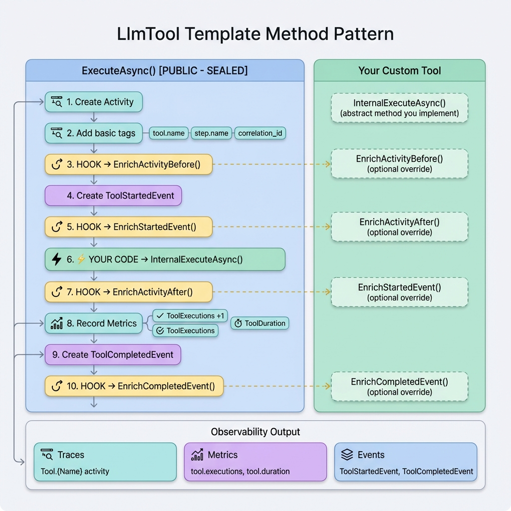
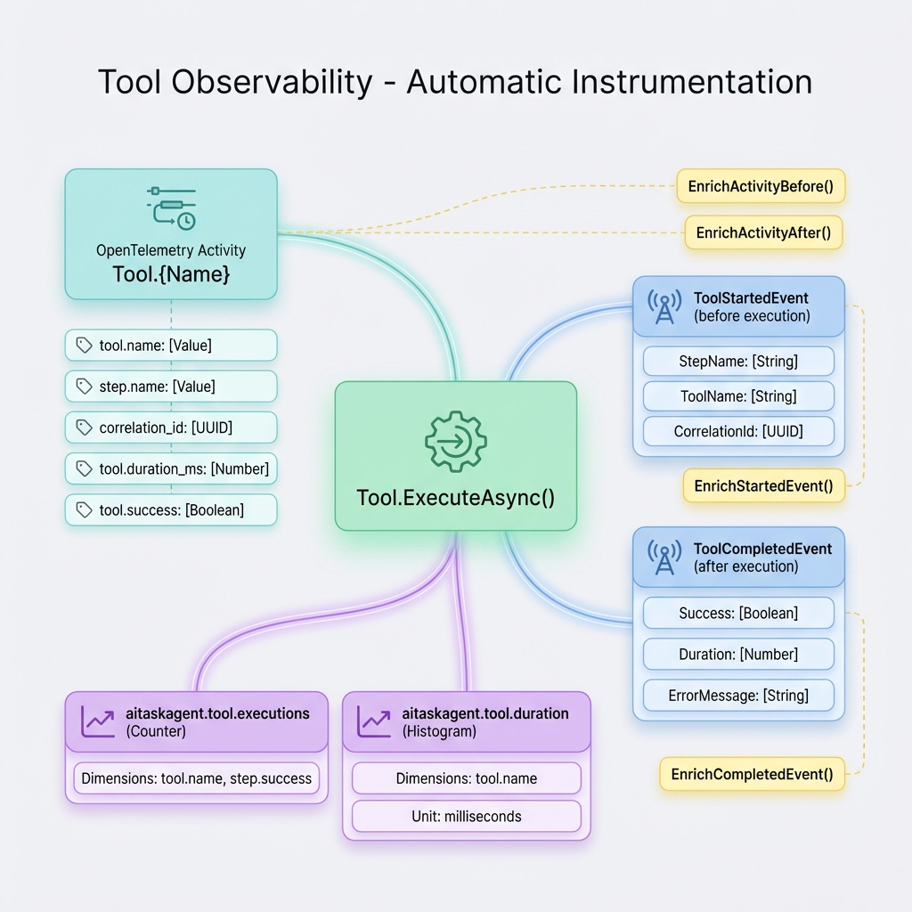
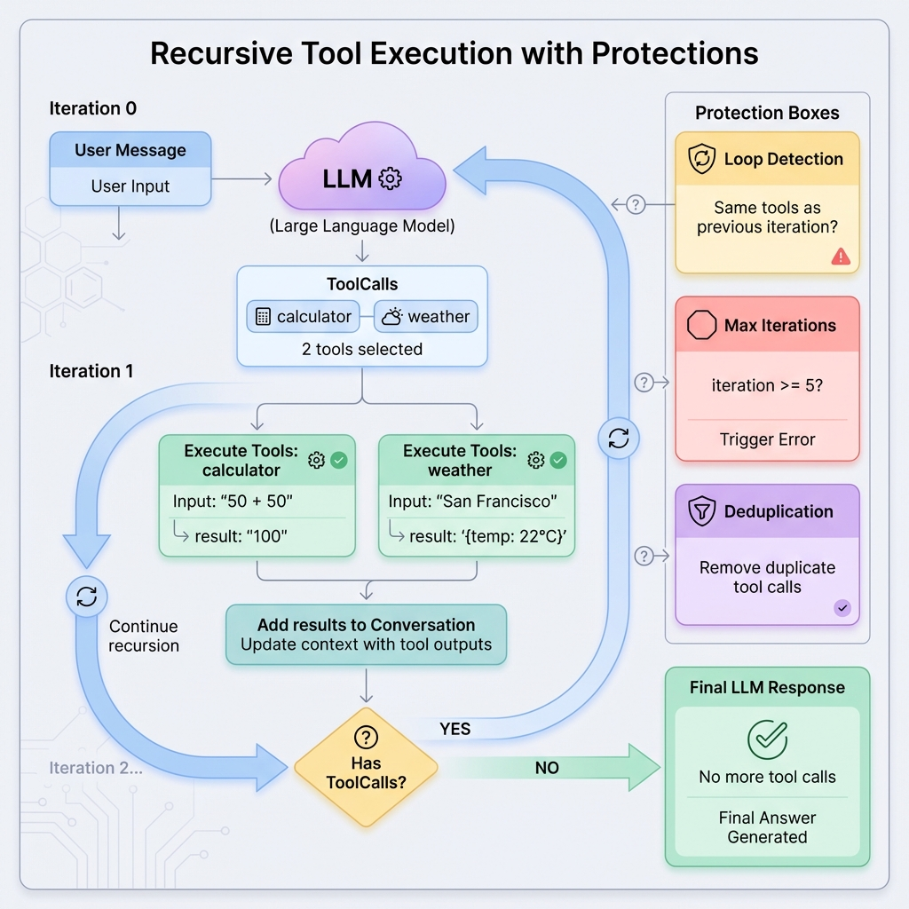

# Tools - Advanced Guide

## Overview

This guide covers advanced topics for creating and using tools in AITaskAgent Framework, including the `LlmTool` base class, recursive execution, observability, and best practices.

## LlmTool vs ITool

You have two options when creating tools:

| Approach | When to Use | Observability | Complexity |
|----------|-------------|---------------|------------|
| **Implement `ITool`** | Simple tools, full control | Manual | Low |
| **Extend `LlmTool`** | Most cases, automatic observability | Automatic | Medium |

### Recommendation

**Use `LlmTool` for 99% of cases** - it provides automatic observability (traces, metrics, events) and follows the Template Method pattern for consistency.

---

## LlmTool Base Class

`LlmTool` is an abstract base class that implements `ITool` with built-in observability and the Template Method pattern.



### Template Method Pattern

The `ExecuteAsync()` method is **sealed** (you cannot override it). It controls the execution flow and calls your implementation at the right time:

```csharp
public abstract class LlmTool : ITool
{
    // ❌ SEALED - You cannot override this
    public async Task<string> ExecuteAsync(
        string argumentsJson,
        PipelineContext context,
        string stepName,
        ILogger logger,
        CancellationToken cancellationToken = default)
    {
        // 1. Create trace activity
        // 2. Add basic tags
        // 3. HOOK: EnrichActivityBefore()
        // 4. Send ToolStartedEvent
        // 5. HOOK: EnrichStartedEvent()
        // 6. ⚡ YOUR CODE: InternalExecuteAsync()
        // 7. HOOK: EnrichActivityAfter()
        // 8. Record metrics
        // 9. Send ToolCompletedEvent
        // 10. HOOK: EnrichCompletedEvent()
    }

    // ✅ ABSTRACT - You MUST implement this
    protected abstract Task<string> InternalExecuteAsync(
        string argumentsJson,
        CancellationToken cancellationToken);
}
```

### Required Implementation

You must implement these abstract members:

```csharp
public class WeatherTool : LlmTool
{
    // 1. Tool name (unique identifier)
    public override string Name => "get_weather";
    
    // 2. Description for LLM
    public override string Description => 
        "Gets current weather for a location";
    
    // 3. JSON Schema for parameters
    protected override BinaryData ParametersSchema => BinaryData.FromString("""
    {
        "type": "object",
        "properties": {
            "location": {
                "type": "string",
                "description": "City name"
            },
            "unit": {
                "type": "string",
                "enum": ["celsius", "fahrenheit"]
            }
        },
        "required": ["location"]
    }
    """);
    
    // 4. Your tool logic
    protected override async Task<string> InternalExecuteAsync(
        string argumentsJson,
        CancellationToken cancellationToken)
    {
        var args = JsonSerializer.Deserialize<WeatherArgs>(argumentsJson);
        var weather = await FetchWeatherAsync(args.Location, args.Unit);
        return JsonSerializer.Serialize(weather);
    }
}

record WeatherArgs(string Location, string? Unit = "celsius");
```

---

## Automatic Observability

`LlmTool` automatically emits observability data **without any extra code**:



### What Gets Emitted

| Type | Name | Description |
|------|------|-------------|
| **Trace** | `Tool.{Name}` | OpenTelemetry activity |
| **Event** | `ToolStartedEvent` | Before execution |
| **Event** | `ToolCompletedEvent` | After execution (success/error) |
| **Metric** | `aitaskagent.tool.executions` | Counter with dimensions |
| **Metric** | `aitaskagent.tool.duration` | Histogram in milliseconds |

### Trace Tags

Automatically added to every tool execution:

- `tool.name` - Tool identifier
- `step.name` - Step that invoked the tool
- `correlation_id` - Request correlation ID
- `tool.duration_ms` - Execution time
- `tool.success` - Boolean success flag

---

## Enrichment Hooks

Customize observability data by overriding virtual hooks:

### EnrichActivityBefore()

Add custom tags **before** your tool executes:

```csharp
protected override void EnrichActivityBefore(
    Activity? activity,
    string argumentsJson,
    PipelineContext context)
{
    var args = JsonSerializer.Deserialize<WeatherArgs>(argumentsJson);
    activity?.SetTag("weather.location", args.Location);
    activity?.SetTag("weather.unit", args.Unit ?? "celsius");
}
```

### EnrichActivityAfter()

Add result-specific tags **after** execution:

```csharp
protected override void EnrichActivityAfter(
    Activity? activity,
    string result,
    PipelineContext context)
{
    var weather = JsonSerializer.Deserialize<WeatherResult>(result);
    activity?.SetTag("weather.temperature", weather.Temp);
    activity?.SetTag("weather.condition", weather.Condition);
}
```

### EnrichStartedEvent()

Add custom data to the started event:

```csharp
protected override ToolStartedEvent EnrichStartedEvent(
    ToolStartedEvent baseEvent,
    string argumentsJson,
    PipelineContext context)
{
    return baseEvent with
    {
        AdditionalData = new Dictionary<string, object?>
        {
            ["arguments"] = argumentsJson
        }
    };
}
```

### EnrichCompletedEvent()

Add custom data to the completed event:

```csharp
protected override ToolCompletedEvent EnrichCompletedEvent(
    ToolCompletedEvent baseEvent,
    string result,
    PipelineContext context)
{
    return baseEvent with
    {
        AdditionalData = new Dictionary<string, object?>
        {
            ["result_length"] = result.Length,
            ["result_preview"] = result[..Math.Min(100, result.Length)]
        }
    };
}
```

---

## Recursive Tool Execution

Tools are executed **recursively** until the LLM returns a final response without tool calls.



### Execution Flow

1. **User sends message** → LLM
2. **LLM returns ToolCalls** (e.g., `["calculator", "weather"]`)
3. **Execute tools** in parallel
4. **Add results to conversation**
5. **Recursive call** → LLM again with tool results
6. **LLM processes results** and either:
   - Returns more ToolCalls → Go to step 3
   - Returns final response → Done

### Example Conversation Flow

```
Iteration 0:
  User: "What's 25 * 4? Also, what's the weather in Paris?"
  LLM: [ToolCall: calculator(25, 4), ToolCall: weather("Paris")]

Iteration 1:
  Tool Results: calculator → "100", weather → "{temp: 22°C, sunny}"
  LLM: [Final Response: "25 × 4 = 100. Paris is 22°C and sunny."]
```

### MaxToolIterations

Prevent infinite loops by limiting iterations:

```csharp
var llmStep = new LlmStep<In, Out>(...)
{
    MaxToolIterations = 5  // Default: 5
};
```

If the limit is reached, an exception is thrown:
```
InvalidOperationException: Maximum tool iterations (5) exceeded - possible infinite loop
```

---

## Protection Mechanisms

### 1. Loop Detection

Detects if the LLM requests the **exact same tools** as the previous iteration:

```csharp
// Iteration 1: LLM requests ["calculator", "weather"]
// Iteration 2: LLM requests ["calculator", "weather"] again
// → Loop detected! Force final response without tools
```

**Log message:**
```
Detected potential tool loop: LLM requested same tools as previous iteration.
Forcing final response without tools.
```

### 2. Deduplication

Removes duplicate tool calls **within the same batch**:

```csharp
// LLM returns:
// - calculator(50, 50)
// - weather("Paris")
// - calculator(50, 50)  ← Duplicate!

// Only execute:
// - calculator(50, 50) once
// - weather("Paris")

// But add result to conversation for BOTH calculator calls
```

**Log message:**
```
Deduplicated 1 duplicate tool calls from batch of 3
```

### 3. Tool Not Found Handling

If a tool doesn't exist in the registry:

```csharp
// LLM requests: unknown_tool()
// → Error message added to conversation: "Error: Tool 'unknown_tool' not found"
// → ToolCompletedEvent sent with Success=false
```

---

## Complete Example with Enrichment

```csharp
using AITaskAgent.LLM.Tools.Base;
using System.Diagnostics;
using System.Text.Json;

public class DatabaseQueryTool : LlmTool
{
    private readonly IDbConnection _db;
    
    public DatabaseQueryTool(IDbConnection db)
    {
        _db = db;
    }
    
    public override string Name => "query_database";
    
    public override string Description => 
        "Executes SQL SELECT queries on the database";
    
    protected override BinaryData ParametersSchema => BinaryData.FromString("""
    {
        "type": "object",
        "properties": {
            "query": {
                "type": "string",
                "description": "SQL SELECT query to execute"
            },
            "limit": {
                "type": "integer",
                "description": "Maximum rows to return",
                "default": 100
            }
        },
        "required": ["query"]
    }
    """);
    
    protected override async Task<string> InternalExecuteAsync(
        string argumentsJson,
        CancellationToken cancellationToken)
    {
        var args = JsonSerializer.Deserialize<QueryArgs>(argumentsJson);
        
        // Validate query is SELECT only
        if (!args.Query.TrimStart().StartsWith("SELECT", StringComparison.OrdinalIgnoreCase))
        {
            throw new ArgumentException("Only SELECT queries are allowed");
        }
        
        // Execute query
        var results = await _db.QueryAsync(args.Query, cancellationToken);
        var limited = results.Take(args.Limit ?? 100).ToList();
        
        return JsonSerializer.Serialize(new
        {
            rows = limited,
            count = limited.Count,
            truncated = results.Count() > limited.Count
        });
    }
    
    // ENRICHMENT: Add query details to trace
    protected override void EnrichActivityBefore(
        Activity? activity,
        string argumentsJson,
        PipelineContext context)
    {
        var args = JsonSerializer.Deserialize<QueryArgs>(argumentsJson);
        activity?.SetTag("db.query", args.Query);
        activity?.SetTag("db.limit", args.Limit ?? 100);
    }
    
    // ENRICHMENT: Add result stats to trace
    protected override void EnrichActivityAfter(
        Activity? activity,
        string result,
        PipelineContext context)
    {
        var resultObj = JsonSerializer.Deserialize<QueryResult>(result);
        activity?.SetTag("db.rows_returned", resultObj.Count);
        activity?.SetTag("db.truncated", resultObj.Truncated);
    }
    
    // ENRICHMENT: Add query to started event
    protected override ToolStartedEvent EnrichStartedEvent(
        ToolStartedEvent baseEvent,
        string argumentsJson,
        PipelineContext context)
    {
        var args = JsonSerializer.Deserialize<QueryArgs>(argumentsJson);
        return baseEvent with
        {
            AdditionalData = new Dictionary<string, object?>
            {
                ["query"] = args.Query,
                ["limit"] = args.Limit
            }
        };
    }
}

record QueryArgs(string Query, int? Limit = 100);
record QueryResult(List<object> Rows, int Count, bool Truncated);
```

---

## Error Handling

### In InternalExecuteAsync

**Option 1: Throw exceptions** (recommended for system errors):

```csharp
protected override async Task<string> InternalExecuteAsync(
    string argumentsJson,
    CancellationToken cancellationToken)
{
    if (invalidInput)
        throw new ArgumentException("Invalid input");
    
    // LlmTool catches exception, logs it, sends error event, re-throws
}
```

**Option 2: Return error messages** (for recoverable errors):

```csharp
protected override async Task<string> InternalExecuteAsync(
    string argumentsJson,
    CancellationToken cancellationToken)
{
    if (notFound)
        return "Error: Resource not found";
    
    // LLM can see the error and potentially retry or adjust
}
```

### What Happens on Exception

1. Exception is caught by `LlmTool.ExecuteAsync()`
2. Logged as error with full stack trace
3. Activity status set to `Error`
4. `ToolCompletedEvent` sent with `Success=false`, `ErrorMessage=ex.Message`
5. Metrics recorded: `tool.executions` (success=false)
6. Exception is **re-thrown** to caller

---

## Best Practices

### 1. Keep Tools Focused

❌ **Bad**: One tool does everything
```csharp
public class MegaTool : LlmTool
{
    // Handles weather, calculator, database, email, etc.
}
```

✅ **Good**: One tool, one purpose
```csharp
public class WeatherTool : LlmTool { }
public class CalculatorTool : LlmTool { }
public class EmailTool : LlmTool { }
```

### 2. Return Structured Data

✅ **Good**: Return JSON for complex data
```csharp
return JsonSerializer.Serialize(new
{
    temperature = 22,
    condition = "sunny",
    humidity = 65
});
```

❌ **Bad**: Return plain text that's hard to parse
```csharp
return "It's 22 degrees and sunny with 65% humidity";
```

### 3. Validate Input

```csharp
protected override async Task<string> InternalExecuteAsync(
    string argumentsJson,
    CancellationToken cancellationToken)
{
    QueryArgs? args;
    try
    {
        args = JsonSerializer.Deserialize<QueryArgs>(argumentsJson);
    }
    catch (JsonException ex)
    {
        throw new ArgumentException($"Invalid JSON: {ex.Message}");
    }
    
    ArgumentNullException.ThrowIfNull(args);
    ArgumentException.ThrowIfNullOrWhiteSpace(args.Query);
    
    // ... rest of logic
}
```

### 4. Use Descriptive Schemas

✅ **Good**: Clear descriptions help the LLM
```json
{
    "location": {
        "type": "string",
        "description": "City name, e.g., 'London', 'New York', 'Tokyo'"
    }
}
```

❌ **Bad**: No description
```json
{
    "location": { "type": "string" }
}
```

### 5. Handle Cancellation

```csharp
protected override async Task<string> InternalExecuteAsync(
    string argumentsJson,
    CancellationToken cancellationToken)
{
    // Pass cancellation token to async operations
    var result = await httpClient.GetAsync(url, cancellationToken);
    
    // Check for cancellation in loops
    foreach (var item in items)
    {
        cancellationToken.ThrowIfCancellationRequested();
        // ... process item
    }
}
```

---

## Troubleshooting

### Tool Not Being Called

**Symptoms**: LLM doesn't use your tool even though it should

**Possible causes**:
1. Tool not registered in `IToolRegistry`
2. Tool not passed to `BaseLlmStep` constructor
3. Tool name/description unclear to LLM
4. JSON schema too complex

**Solutions**:
```csharp
// 1. Verify registration
var tool = registry.GetTool("my_tool");
if (tool == null)
    throw new Exception("Tool not registered!");

// 2. Verify passed to step
var tools = new List<ITool> { myTool };
var step = new LlmStep(..., tools: tools);

// 3. Improve description
public override string Description => 
    "Gets current weather for ANY city in the world. " +
    "Use this when user asks about temperature, conditions, or forecast.";
```

### Infinite Loop / Max Iterations Exceeded

**Symptoms**: `InvalidOperationException: Maximum tool iterations (5) exceeded`

**Possible causes**:
1. Tool returns incomplete/invalid data
2. LLM doesn't understand tool result format
3. Tool has a bug and always fails

**Solutions**:
```csharp
// 1. Return complete, structured data
return JsonSerializer.Serialize(new
{
    success = true,
    data = actualData,
    message = "Operation completed successfully"
});

// 2. Add clear success indicators
if (success)
    return $"SUCCESS: {result}";
else
    return $"ERROR: {errorMessage}";

// 3. Increase limit temporarily for debugging
var step = new LlmStep(...) { MaxToolIterations = 10 };
```

### Tool Called Multiple Times with Same Arguments

**Symptoms**: Logs show "Deduplicated X duplicate tool calls"

**Cause**: LLM is requesting the same tool multiple times in one response

**This is normal** - the framework handles it automatically by:
- Executing the tool only once
- Caching the result
- Adding the same result to conversation for each `tool_call_id`

**No action needed** unless it happens excessively (indicates LLM confusion).

---

## See Also

- [Tools Guide](tools.md) - Basic tool usage
- [Custom Tools](../extensibility/custom-tools.md) - Creating custom tools
- [Event System](event-system.md) - Observability events
- [OpenTelemetry](opentelemetry.md) - Metrics and traces
