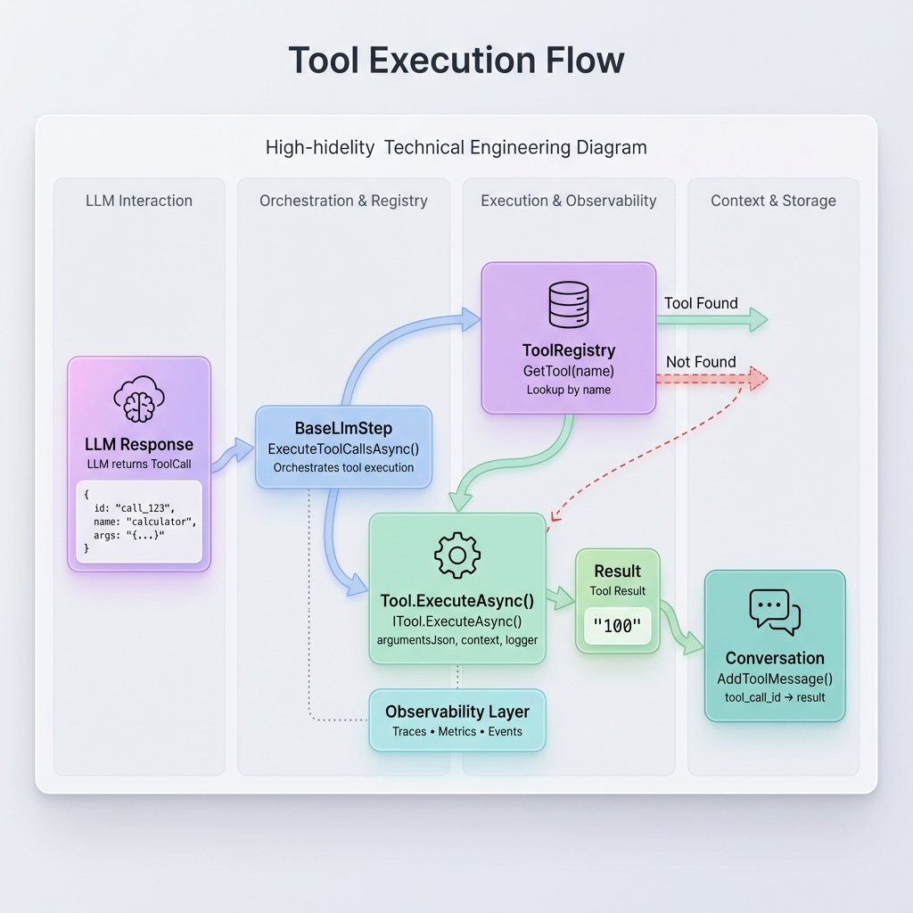

## Overview

Tools are functions that LLMs can call to perform actions or get information. The framework provides two ways to create tools:

1. **`LlmTool` (Recommended)** - Abstract base class with automatic observability
2. **`ITool`** - Interface for full control



> [!TIP]
> For advanced topics including recursive execution, observability enrichment, and best practices, see the [Tools Advanced Guide](tools-advanced.md).

---

## Quick Start with LlmTool

The recommended way to create tools is by extending `LlmTool`:

```csharp
using AITaskAgent.LLM.Tools.Base;
using System.Text.Json;

public class WeatherTool : LlmTool
{
    public override string Name => "get_weather";
    
    public override string Description => 
        "Gets current weather for a location";
    
    protected override BinaryData ParametersSchema => BinaryData.FromString("""
    {
        "type": "object",
        "properties": {
            "location": {
                "type": "string",
                "description": "City name, e.g. 'London'"
            }
        },
        "required": ["location"]
    }
    """);
    
    protected override async Task<string> InternalExecuteAsync(
        string argumentsJson,
        CancellationToken cancellationToken)
    {
        var args = JsonSerializer.Deserialize<WeatherArgs>(argumentsJson);
        var weather = await FetchWeatherAsync(args.Location);
        return JsonSerializer.Serialize(weather);
    }
}

record WeatherArgs(string Location);
```

**Benefits of `LlmTool`**:
- ✅ Automatic observability (traces, metrics, events)
- ✅ Template Method pattern for consistency
- ✅ Enrichment hooks for custom telemetry
- ✅ Error handling built-in

---

```csharp
using AITaskAgent.Core.Models;
using AITaskAgent.LLM.Models;
using AITaskAgent.LLM.Tools.Abstractions;
using Microsoft.Extensions.Logging;
using Newtonsoft.Json;

public class CalculatorTool : ITool
{
    public string Name => "calculator";
    public string Description => "Performs basic arithmetic operations";
    
    public ToolDefinition GetDefinition() => new()
    {
        Name = Name,
        Description = Description,
        Parameters = new
        {
            type = "object",
            properties = new
            {
                operation = new { type = "string", @enum = new[] { "add", "subtract", "multiply", "divide" } },
                a = new { type = "number", description = "First operand" },
                b = new { type = "number", description = "Second operand" }
            },
            required = new[] { "operation", "a", "b" }
        }
    };
    
    public async Task<string> ExecuteAsync(
        string argumentsJson,
        PipelineContext context,
        string stepName,
        ILogger logger,
        CancellationToken cancellationToken = default)
    {
        try
        {
            var args = JsonConvert.DeserializeObject<CalculatorArgs>(argumentsJson);
            
            var result = args.Operation switch
            {
                "add" => args.A + args.B,
                "subtract" => args.A - args.B,
                "multiply" => args.A * args.B,
                "divide" => args.B != 0 ? args.A / args.B : throw new DivideByZeroException(),
                _ => throw new ArgumentException($"Unknown operation: {args.Operation}")
            };
            
            logger.LogInformation("Calculator: {A} {Op} {B} = {Result}", 
                args.A, args.Operation, args.B, result);
            
            return result.ToString();
        }
        catch (Exception ex)
        {
            logger.LogError(ex, "Calculator tool failed");
            return $"Error: {ex.Message}";
        }
    }
    
    private record CalculatorArgs(string Operation, double A, double B);
}
```

## Using Tools in LLM Step

```csharp
var tools = new List<ITool>
{
    new CalculatorTool(),
    new WebSearchTool(),
    new WeatherTool()
};

var step = new LlmStep<QueryResult, AnswerResult>(
    llmService,
    "Assistant",
    profile,
    messageBuilder: (input, ctx) => Task.FromResult(input.Query),
    tools: tools
);
```

## Tool Registry

Register tools for dependency injection:

```csharp
// Registration
services.AddSingleton<IToolRegistry, ToolRegistry>();
var registry = services.GetRequiredService<IToolRegistry>();
registry.Register(new CalculatorTool());
registry.Register(new WebSearchTool());

// Retrieval
var tools = registry.GetAll().ToList();
```

## Observability

Tools automatically emit observability data for monitoring and debugging.

### Events

| Event | When | Properties |
|-------|------|------------|
| `ToolStartedEvent` | Before tool execution | StepName, ToolName, CorrelationId |
| `ToolCompletedEvent` | After execution (success or error) | Success, Duration, ErrorMessage |

```csharp
eventChannel.Subscribe<ToolCompletedEvent>(e => {
    Console.WriteLine($"Tool {e.ToolName}: {(e.Success ? "OK" : e.ErrorMessage)}");
    Console.WriteLine($"Duration: {e.Duration.TotalMilliseconds}ms");
});
```

### Metrics

When using `LlmTool`, these metrics are automatically recorded:

| Metric | Type | Dimensions |
|--------|------|------------|
| `aitaskagent.tool.executions` | Counter | tool.name, step.success |
| `aitaskagent.tool.duration` | Histogram | tool.name |

### Traces

OpenTelemetry activities are created for each tool execution:

- **Activity Name**: `Tool.{Name}`
- **Tags**: tool.name, step.name, correlation_id, tool.duration_ms, tool.success

See [Tools Advanced Guide](tools-advanced.md#automatic-observability) for enrichment hooks.

---

## Best Practices

1. **Keep tools focused** - One tool, one purpose
2. **Return strings** - LLMs work with text
3. **Handle errors** - Return error messages, don't throw
4. **Log execution** - Use the provided logger
5. **Document parameters** - Clear descriptions help LLMs
